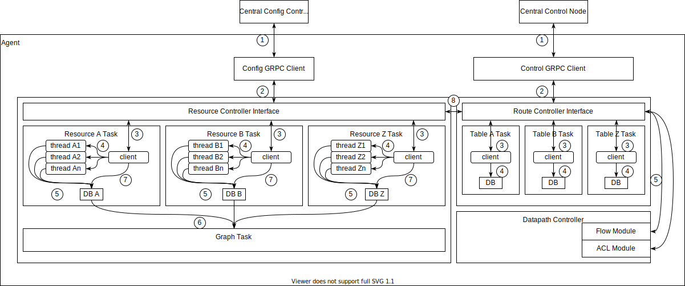

# Goal

The goal is to evaluate the possibility of a lock and wait free architecture allowing the concurrent processing of configuration resource and route information by not relying on the overhead and complexity of task management/scheduling.   
The following proposal describes an approach which relies on channels for inter-task communication and sharding of databases on a per resource basis. By using channels the information exchange between tasks is serialized, sharding of the databases allows to use multiple channels concurrently.

# Architecture

## Config
1. Centralized Config Controller sends add/delete resource requests via GRPC to Agent Config GRPC client.    
Only resources which are required by the agent will be sent.   
2. The Resource Controller Interface provides access to the client interfaces of the resource tasks. It receives configuration resources via GRPC and   
3. calls the respective resource task client interfaces.  Ie:  
`
 resource_controller::A:::add(a1);`  
There is one running resource task per resource which has its own database.    
4. The resource task client creates a thread per received resource. This thread has the resource specific business logic implementation and processes the resource.  
5. Each thread uses a *channel* to update the database after successfull processing of the resource.  This is a Multi Producer Single Consumer (MSPC) channel to ensure a serialization of the database updates.      
6. Each database interface has a channel to the Graph task. When a resource is updated in the database, the database will add/change nodes and edges in the Graph.  
7. The resource task client has a get/list interface to the database for retrieving resources.  
8. The Resource Controller Interface communicates with the Route Controller Interface for updating the routing tables.

## Control